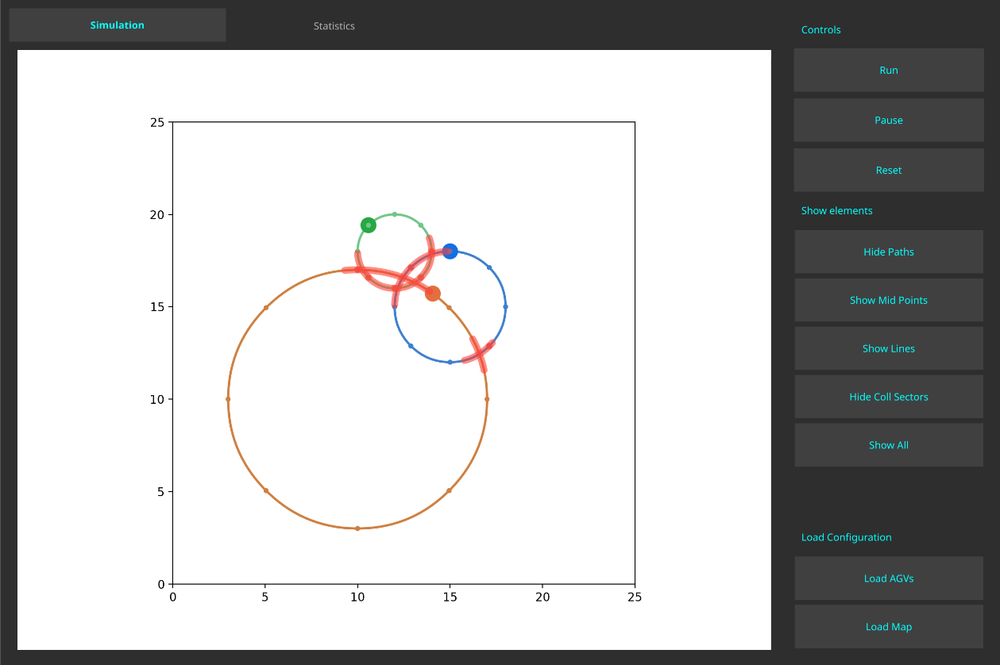
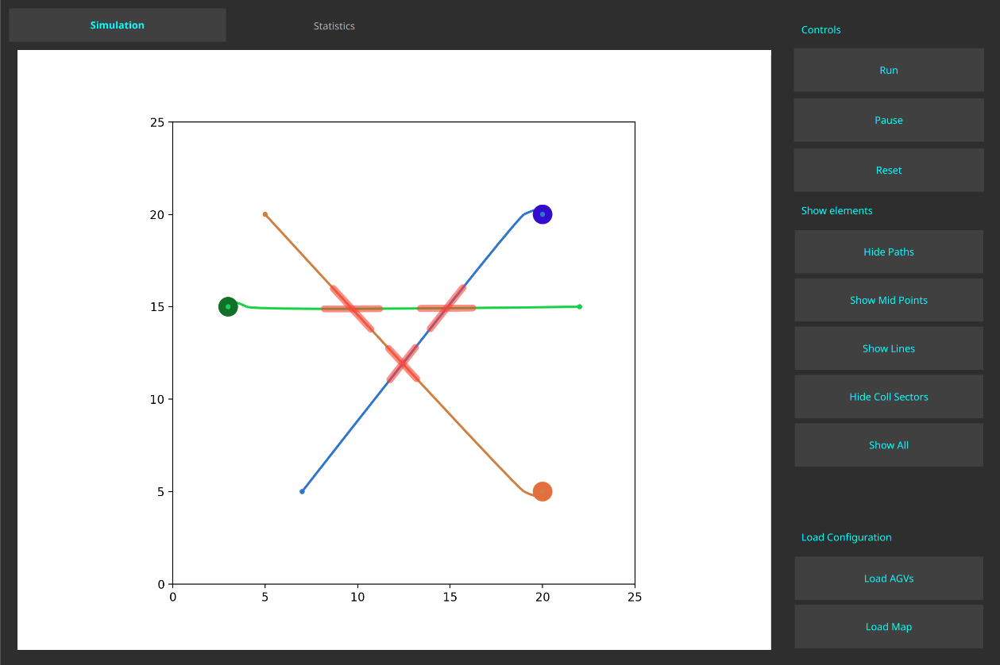
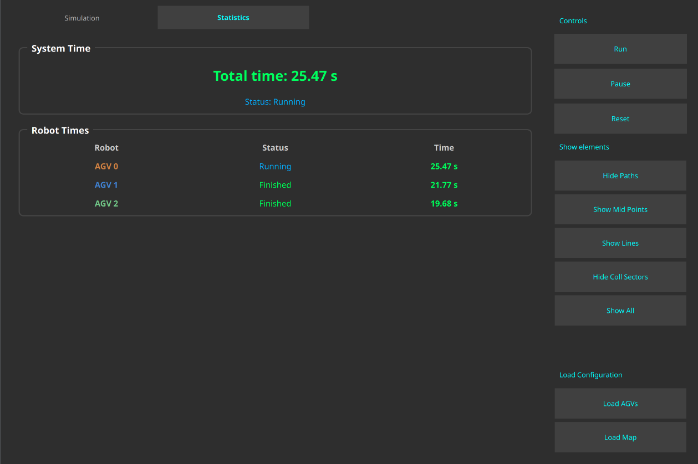
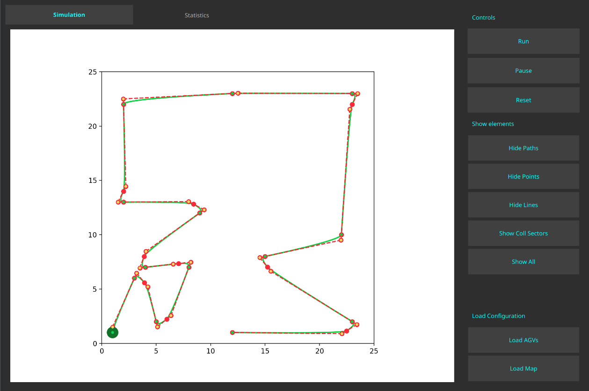

# MMRS Simulator

<p align="center">
  <strong>Multi-Mobile Robot System Simulator for Deadlock Avoidance Research</strong>
</p>

<p align="center">
  
  
  
  
</p>

<p align="center">
  <a href="#overview">Overview</a> •
  <a href="#key-features">Features</a> •
  <a href="#installation">Installation</a> •
  <a href="#usage">Usage</a> •
  <a href="#configuration">Configuration</a> •
  <a href="#architecture">Architecture</a>
</p>

---

## Overview

**MMRS Simulator** is a research-oriented simulation platform developed as part of a Master's thesis at [Wrocław University of Science and Technology](https://pwr.edu.pl/en/). The application provides a comprehensive environment for simulating **Multi-Mobile Robot Systems (MMRS)** with focus on:

- **Deadlock Avoidance** — Safe resource allocation using Banker's algorithm
- **Trajectory Optimization** — Smooth path generation with quadratic Bézier curves  
- **Performance Analysis** — Real-time metrics for system evaluation

<p align="center">
  
  <br/>
  <em>Main simulation view with multiple AGVs navigating through shared workspace</em>
</p>

## Key Features

### Collision Sector Detection

The simulator automatically detects and visualizes potential collision zones between robot trajectories, enabling proactive conflict resolution.

<p align="center">
  
  <br/>
  <em>Visualization of collision sectors (highlighted in red) where robot paths intersect</em>
</p>

### Real-Time Statistics

Monitor individual robot performance and system-wide metrics during simulation execution.

<p align="center">
  
  <br/>
  <em>Statistics tab showing completion times and status for each robot</em>
</p>

### Path creation

If path of the robot is not defined the robot automatically creates the path using Bezier curves bazed on the marked points.

<p align="center">
  
  <br/>
  <em>Path created using Bezier curves</em>
</p>

### Feature Summary

| Feature | Description |
|---------|-------------|
| **Path Planning** | Automatic path generation using quadratic Bézier curves |
| **Collision Detection** | Real-time detection of potential collision sectors |
| **Deadlock Avoidance** | Banker's algorithm implementation for safe resource allocation |
| **Resource Management** | Priority-based allocation with request/release protocol |
| **Performance Metrics** | Individual and system completion time measurement |
| **Visual Debugging** | Interactive visualization of paths, control points, and sectors |
| **YAML Configuration** | Flexible robot configuration for easy scenario setup |

## Installation

### Prerequisites

- Python 3.10+
- Poetry (dependency management)

### Quick Start

```bash
git clone https://github.com/Mastej-Git/mmrs-sim.git
cd mmrs-sim

make setup-env
poetry env activate
make run
```

### Manual Installation

```bash
curl -sSL https://install.python-poetry.org | python3 -

poetry install
poetry shell
python main.py
```

## Usage

### Simulation Workflow

```
1. Load AGVs    →    2. Run Simulation    →    3. Analyze Results
   (YAML config)        (Real-time view)         (Statistics tab)
```

### Controls

| Button | Action |
|--------|--------|
| **Run** | Start/resume simulation |
| **Pause** | Pause simulation and timing |
| **Reset** | Reset robots to initial positions |

### Keyboard Shortcuts

| Key | Action |
|-----|--------|
| `Space` | Start/Stop simulation |
| `R` | Full reset |
| `Q` | Quit application |

## Configuration

### Visualization Options

| Option | Description |
|--------|-------------|
| **Show Paths** | Display Bézier curve trajectories |
| **Show Mid Points** | Display control points of Bézier curves |
| **Show Lines** | Display connection lines between control points |
| **Show Coll Sectors** | Highlight collision sectors on paths |

## Configuration

### Robot Definition (YAML)

```yaml
agvs:
  - id: agv0
    marked_states:
      - [3, 15]
      - [22, 15]
    orientation: [0, 1]
    radius: 0.5
    max_v: 2.0
    max_a: 1.0
    color: "#12700EFF"
    path_color: "#17D220"

  - id: agv1
    marked_states:
      - [20, 20]
      - [7, 5]
    orientation: [0, 1]
    radius: 0.5
    max_v: 2.0
    max_a: 1.0
    color: "#330DCEFF"
    path_color: "#2F75CB"
```

### Parameters

| Parameter | Type | Description |
|-----------|------|-------------|
| `id` | string | Unique robot identifier |
| `marked_states` | list | Waypoints `[x, y]` to visit |
| `orientation` | list | Initial direction vector |
| `radius` | float | Robot collision radius |
| `max_v` | float | Maximum velocity (units/s) |
| `max_a` | float | Maximum acceleration (units/s²) |
| `color` | string | Robot color (hex RGBA) |
| `path_color` | string | Path color (hex) |

## Architecture

```
┌─────────────────────────────────────────────────────────────┐
│                        GUI Layer                            │
│              PyQt5 + Matplotlib Visualization               │
└─────────────────────────────────────────────────────────────┘
                              │
                              ▼
┌─────────────────────────────────────────────────────────────┐
│                  Supervisor (DES Layer)                     │
│  ┌──────────────┐  ┌──────────────┐  ┌──────────────────┐   │
│  │     RAM      │  │  Collision   │  │  Path Creation   │   │
│  │  (Resource   │  │   Sector     │  │   Algorithm      │   │
│  │  Allocation) │  │  Detection   │  │  (Bézier)        │   │
│  └──────────────┘  └──────────────┘  └──────────────────┘   │
└─────────────────────────────────────────────────────────────┘
                              │
                              ▼
┌─────────────────────────────────────────────────────────────┐
│                   Robot Control Layer                       │
│         StagePassControl  +  RobotMotionControl             │
└─────────────────────────────────────────────────────────────┘
                              │
                              ▼
┌─────────────────────────────────────────────────────────────┐
│                    AGV (Robot Model)                        │
│              Continuous Time Simulation                     │
└─────────────────────────────────────────────────────────────┘
```

## Theoretical Background

### Path Generation

Trajectories are generated using **quadratic Bézier curves**:

$$B(t) = (1-t)^2 P_0 + 2(1-t)t P_1 + t^2 P_2, \quad t \in [0, 1]$$

### Velocity Profile

Adaptive velocity based on kinematic constraints:

$$v_{max} = \sqrt{v_{end}^2 + 2 \cdot a_{max} \cdot d_{remaining}}$$

### Deadlock Avoidance

Banker's algorithm ensures safe resource allocation by verifying that granting a resource request does not lead to a deadlock state.

## Project Structure

```
mmrs-simulator/
├── main.py                      # Entry point
├── GUI.py                       # Main window
├── control/
│   ├── AGV.py                   # Robot model
│   ├── RobotState.py            # State management
│   ├── RobotMotionControl.py    # Velocity control
│   ├── StagePassControl.py      # Speed profile
│   ├── StageTransitionControl.py # Supervisor
│   ├── Resource.py              # Shared resources
│   ├── PathCreationAlgorithm.py # Bézier paths
│   └── CollisionSectorAlgorithm.py
├── mpl_widgets/
│   └── Visualizer.py            # Visualization
├── utils/
│   ├── YamlAGVLoader.py
│   └── StyleSheet.py
├── agvs_desc/                   # Robot configs
└── docs/figures/                # Screenshots
```

## Development

| Tool | Purpose |
|------|---------|
| [Poetry](https://python-poetry.org/) | Dependency management |
| [Ruff](https://docs.astral.sh/ruff/) | Linting & formatting |
| [PyQt5](https://pypi.org/project/PyQt5/) | GUI framework |
| [Matplotlib](https://matplotlib.org/) | Visualization |

## Roadmap

- [ ] Petri net-based DES abstraction
- [ ] Dynamic path replanning
- [ ] Multi-objective optimization
- [ ] ROS 2 integration
- [ ] Extended algorithm comparison

## Author

**Michał Mastej**

Master's Thesis — Wrocław University of Science and Technology  
Faculty of Electronics, Photonics and Microsystems  
Control Engineering and Robotics

## License

This project is developed for academic purposes as part of a Master's thesis.
